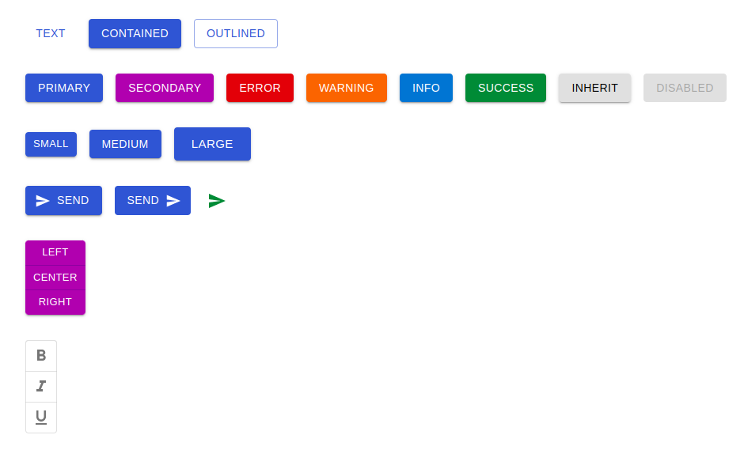
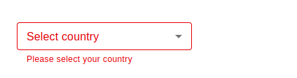

# React Material UI Demo

This project was a demo for exploring Material UI library for React. In this project, I have created components for most if not all of the components in the Material UI library. By doing this, I was able to explore the different props that each component has and how they can be used to create a more dynamic UI. Below is the project structure and a brief description of each component.

## Project Structure

### Components

#### 1. Inputs

1. [Buttons, Button Group, Toggle Button and ToggleButtonGroup](./src/components/inputs/MuiButton.tsx)

   

2. [TextField](./src/components/inputs/MuiTextField.tsx)

   

3. [Select](./src/components/inputs/MuiSelect.tsx)

   

4. [Radio Button and Radio Group](./src/components/inputs/MuiRadioButton.tsx)

   

5. [Checkbox](./src/components/inputs/MuiCheckbox.tsx)

   

6. [Switch](./src/components/inputs/MuiSwitch.tsx)

   

7. [Rating](./src/components/inputs/MuiRating.tsx)

   

8. [Auto Complete](./src/components/inputs/MuiAutocomplete.tsx)

   

#### 2. [Layout](./src/components/layout/MuiLayout.tsx)

- All the layout components have been used on the [layout](./src/components/layout/MuiLayout.tsx) module. They include:

  1. Box
  2. Stack
  3. Grid

  

#### 3. Surfaces

1. Paper - Paper has been used on the [Layout](./src/components/layout/MuiLayout.tsx) module.
2. [Card](./src/components/surfaces/MuiCard.tsx)

   

3. [Accordion](./src/components/surfaces/MuiAccordion.tsx)

   

4. [Image List](./src/components/surfaces/MuiImageList.tsx)

   

5. App Bar - App Bar has been used on the [Navbar](./src/components/navigation/MuiNavbar.tsx) module.

   

#### 4. Navigation

1. Menu - Menu has been used on the [Navbar](./src/components/navigation/MuiNavbar.tsx) module.

   

2. [Link](./src/components/navigation/MuiLink.tsx)

   

3. [Breadcrumbs](./src/components/navigation/MuiBreadcrumbs.tsx)

   

4. [Drawer](./src/components/navigation/MuiDrawer.tsx)

   

5. [Speed Dial](./src/components/navigation/MuiSpeedDial.tsx)

   

6. [Bottom Navigation](./src/components/navigation/MuiBottonNavigation.tsx)

   

7. [Tabs](./src/components/navigation/MuiTabs.tsx) - TabContent, TabList and TabPanel are lab components.

   

#### 5. Data Display

1. [Avatar](./src/components/data-display/MuiAvatar.tsx)

   

2. [Badge](./src/components/data-display/MuiBadge.tsx)

   

3. [List](./src/components/data-display/MuiList.tsx)

   

4. [Chip](./src/components/data-display/MuiChip.tsx)

   

5. [Tooltip](./src/components/data-display/MuiTooltip.tsx)

   

6. [Table](./src/components/data-display/MuiTable.tsx)

   

7. [Typography](./src/components/data-display/MuiTypography.tsx)

   

8. Divider - Divider has been used on some of the listed components such the [List](./src/components/data-display/MuiList.tsx) component.

   

9. Icon - Icon has been used on some of the listed components such the [Badge](./src/components/data-display/MuiBadge.tsx) component.

   

#### 6. Feedback

1. [Alert](./src/components/feedback/MuiAlert.tsx)

   

2. [Snackbar](./src/components/feedback/MuiSnackbar.tsx)

   

3. [Dialog](./src/components/feedback/MuiDialog.tsx)

   

4. [Progress](./src/components/feedback/MuiProgress.tsx)

   

5. [Skeleton](./src/components/feedback/MuiSkeleton.tsx)

   

#### 7. MUI X

- To use these components, configure `App.tsx` as shown on commit `Date and Time Picker` file [App.tsx](https://github.com/justicenyaga/react_mui_demo/commit/610289540b4a6d09425af2e98a70818587986d91/src/App.tsx) .
- The following `@mui/x-date-pickers` components have been used on the [Pickers](./src/components/mui-x/MuiPicker.tsx) module:

  1. DatePicker
  2. TimePicker
  3. DateTimePicker

     

4. [Date Range Picker](./src/components/mui-x/MuiDateRangePicker.tsx)

   

#### 8. Lab

1. [Loading Button](./src/components/lab/MuiLoadingButton.tsx)

   

2. [Timeline](./src/components/lab/MuiTimeline.tsx)

   

3. [Masonry](./src/components/lab/MuiMasonry.tsx)

   

### Customizing Themes

- To check on theme customization, checkout the commit `Customizing Theme` files [App.tsx](https://github.com/justicenyaga/react_mui_demo/commit/b7aa2abf38c0612c7d7708aef1fd86ab3940052a/src/App.tsx), [theme.d.ts](https://github.com/justicenyaga/react_mui_demo/commit/b7aa2abf38c0612c7d7708aef1fd86ab3940052a/src/theme.d.ts), and [MuiResponsiveness.tsx](https://github.com/justicenyaga/react_mui_demo/commit/b7aa2abf38c0612c7d7708aef1fd86ab3940052a/src/components/MuiResponsiveness.tsx)

## Usage

On the root of the project, run:

### `npm install`

To installs all the dependencies for the project.

### `npm start`

To run the app in the development mode.\
Open [http://localhost:3000](http://localhost:3000) to view it in the browser.
